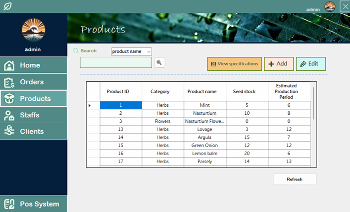

# Edible Flowers and Herbs Sales System
## 💡Overview
This project is a **sales system** for <u>edible flowers and herbs</u>, based on **Windows Forms App (.NET Framework)**.The database management is implemented using **Microsoft SQL Server**.
## 📽️Live demo 
##### https://www.youtube.com/watch?v=KgbYOBv2UBo

## ✨ Key features
### Login 
```
Test Account 
(You can find more accounts with different privileges in SQL Database.)
User Name： admin
Password： 1234
```


### Register/ Forgot Password


### Data Management



### Pos System
Add products into shopping cart and place order in Pos System.


### Home
Check the earnings status on the home page.The account with the highest privileges can set the privileges of other accounts.


## 🚀 Run locally
#### 1. Clone this project to your local environment.

        $ git clone https://github.com/evelynYen97/Edible-Flower-and-Herb-Sales-System.git
    
#### 2. Download and Install Microsoft SQL Server 2022.
👉https://www.microsoft.com/zh-tw/sql-server/sql-server-downloads    

   
#### 3. Restore database
After downloading, open **SQL Server Management Studio 20** and connect to the server. Enter the local machine name in the server name field, and select 'Windows Authentication'. Restore database with **個人專題.bak** in this project file.

#### 4.Run the project
Click **個人專題.sln** to open this project. Remember to update **images_dir** and **image_dirLogin** in **Global var.cs** according to the file locations on your computer. Click the Start button (green triangle) to launch the project.